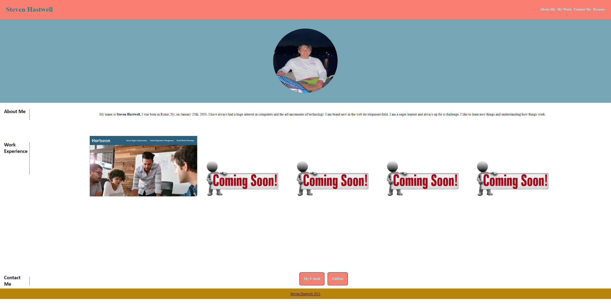

# shastwell-portfolio

## Description:

My portfolio is set up with a nav bar in the beginning with my name starting first and nav links at the end. Each nav link is associated with something different. When I click a button in the nav bar it'll go down to the section it is associated with, or it will open up whatever I am clicking. Each of the buttons are working. I also have an aside bar with names describing the section next to it. I have the sections on the right of the side bar to relay the information I want seen, rather it be text or images with links showcasing my work. I also have a contact me part that includes links in ways to contacting me. I went through a checklist making sure I did all the objectives for this homework assignment.

## Mock-up

The following picture shows what my portfolio looks like:

## Links

https://storm-mercy.github.io/shastwell-portfolio/